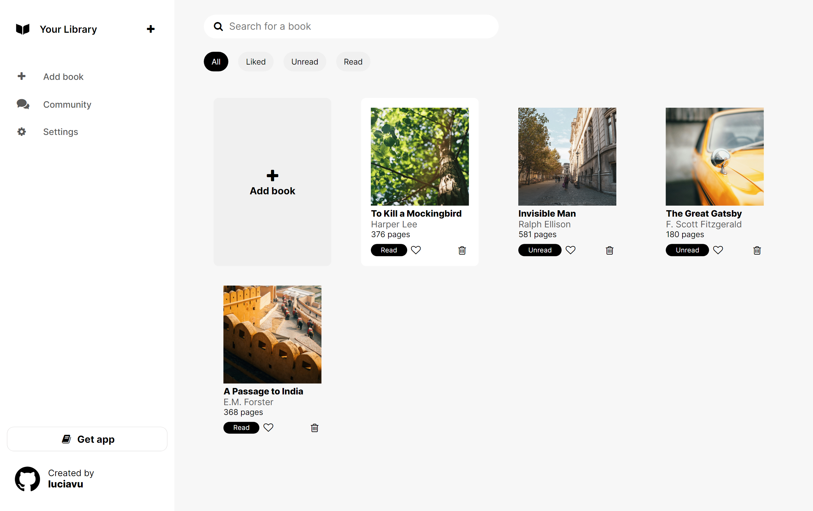

# Library
The Odin Project - JavaScript Course Project 1:

Developing a small object-focused library app using HTML/CSS and JavaScript (local storage). 

## Preview

## Links
Live Link: https://luciavu.github.io/library/

Assignment: https://www.theodinproject.com/lessons/node-path-javascript-library

## Credits
Icons from Fontello: https://fontello.com/

Images from Unsplash by:

- David Vig: https://unsplash.com/@davidvig
- Maria Sime: https://unsplash.com/@mph_
- Nik: https://unsplash.com/@helloimnik
- Parker Hilton: https://unsplash.com/@philton88